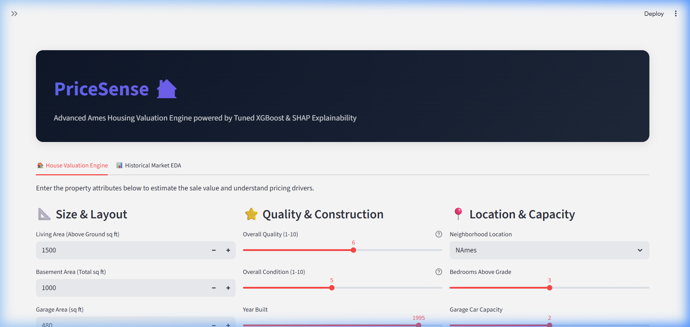
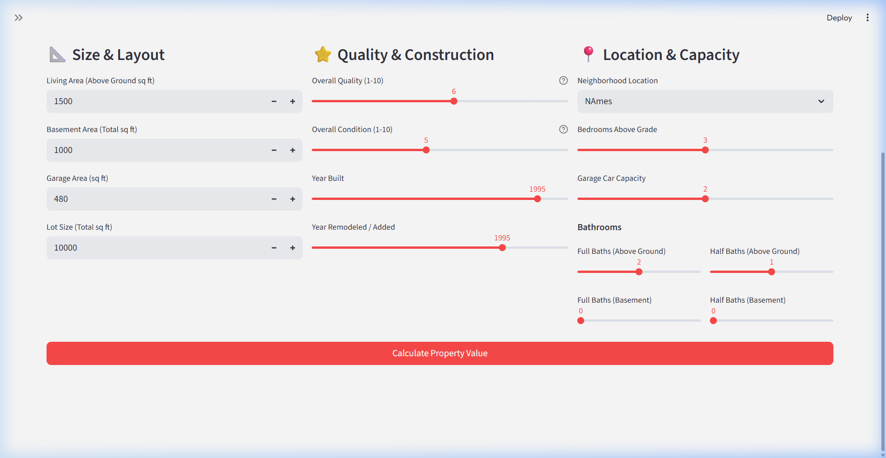
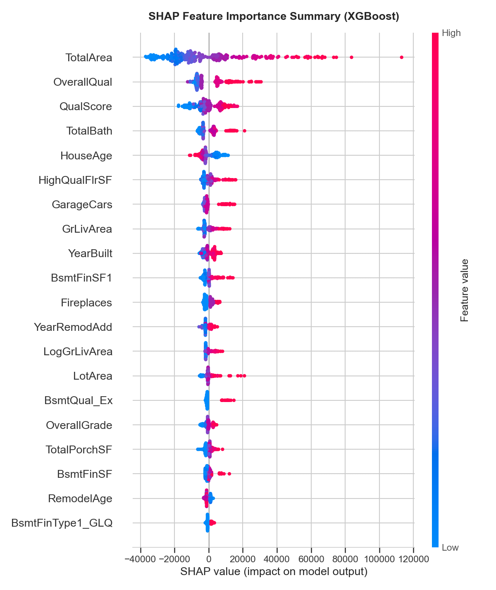

# PriceSense
### Explainable House Price Prediction System using XGBoost and SHAP

PriceSense is an end-to-end explainable machine learning system that predicts residential property prices using 79 housing attributes from the Ames Housing dataset. This repository contains the complete modular Python code, exploratory data analysis (EDA), preprocessing pipelines, model comparison studies, and an interactive prediction dashboard.

---

## Overview

Predicting property values is a standard regression problem in real estate. However, most models act as "black boxes" where users cannot see *why* a house is valued at a certain price. 

**PriceSense** addresses this by combining high-accuracy gradient boosting (XGBoost) with state-of-the-art cooperative game theory explainability (SHAP). It takes the user from a raw dataset of 79 attributes to a fully interpretable web application.

The project architecture features a progressive conceptual layout:
1. **Data Cleaning (Beginner)**: Handling missing values via neighborhood-specific medians and removing extreme outliers (`GrLivArea > 4000`).
2. **Feature Engineering (Intermediate)**: Creating 22 domain-specific interaction variables (e.g., house ages, total bathrooms, quality scores).
3. **Model Comparison (Intermediate)**: Comparing Linear Regression, Random Forest, and XGBoost using 5-Fold Cross Validation.
4. **Hyperparameter Tuning & Explainability (Advanced)**: Performing randomized search CV to optimize XGBoost and using TreeSHAP to calculate global and local pricing drivers.
5. **Interactive Deployment**: Serving predictions and SHAP waterfall plots in an interactive Streamlit UI.

---

## Demo Dashboard

Below is a preview of the interactive prediction dashboard running locally.

### Valuation Interface
Input house attributes and get a predicted price along with a **95% confidence interval** (derived from the model's test RMSE).


### Valuation Explainer (Local SHAP Analysis)
When a user clicks "Calculate Property Value", the app calculates the local SHAP values for the specific house inputs and renders positive/negative value drivers.


---

## Pipeline Architecture

The end-to-end ML pipeline coordinates data loading, plotting, engineering, and training:

```
[Raw Data ID 42165]
       │
       ▼
 [data_loader.py] ── (Cache Raw CSV locally)
       │
       ├────────────────────────┐
       ▼                        ▼
  [eda.py]               [preprocessing.py]
  (Plots saved to        (Outlier Removal: GrLivArea > 4000)
  screenshots/)          (Neighborhood Frontage Median Imputation)
                         (Engineers 22 custom features)
                                │
                                ▼
                           [train.py]
                           (Train-Test Split & 5-Fold CV)
                           (RandomizedSearchCV for XGBoost)
                           (Saves comparison tables)
                           (TreeSHAP Explainer plots)
                                │
                                ▼
                      [Model Serialization]
                      (models/best_model.joblib)
                      (models/preprocessor.joblib)
                                │
                                ▼
                            [app.py]
                       (Streamlit Server)
```

---

## Feature Engineering

While raw datasets contain high-quality metrics, raw variables rarely capture real-world relationships linearly. We engineered **22 domain-specific features** to capture interaction effects:

- **HouseAge**: `YrSold - YearBuilt` (tracks property age at sale time).
- **RemodelAge**: `YrSold - YearRemodAdd` (tracks years since last remodeling).
- **TotalBath**: `FullBath + 0.5 * HalfBath + BsmtFullBath + 0.5 * BsmtHalfBath` (aggregates full/half bathrooms).
- **TotalArea**: `GrLivArea + TotalBsmtSF + GarageArea` (captures total usable property square footage).
- **QualScore**: `OverallQual * OverallCond` (interacts overall material finish with its physical condition).
- **IsNew**: Binary flag for properties sold in the year they were built.
- **LogLotArea / LogGrLivArea**: Logarithmic transforms of highly skewed size features.
- **TotalPorchSF**: Combines wood decks and open/screen/enclosed porches.

These engineered interaction variables significantly boosted XGBoost prediction accuracy compared to training on raw features.

---

## Models & Evaluation Results

We trained and compared three regression models using **5-Fold Cross Validation** on the training set. Here are the evaluation results on the unseen test set (292 houses):

| Model | RMSE | MAE | $R^2$ |
| :--- | :--- | :--- | :--- |
| **Linear Regression (Baseline)** | \$23,480.23 | \$16,805.52 | 89.50% |
| **Random Forest (Intermediate)** | \$24,598.63 | \$16,688.79 | 88.47% |
| **XGBoost (Tuned - Advanced)** | **\$20,311.77** | **\$13,833.80** | **92.14%** |

- **Best XGBoost Parameters**: `subsample=0.6`, `n_estimators=200`, `max_depth=3`, `learning_rate=0.05`, `colsample_bytree=0.6`
- **Generalization**: The 5-fold cross-validation mean $R^2$ score for Tuned XGBoost was **91.53%**, indicating robust generalization and no overfitting.

---

## Interpretability & Explainability (SHAP)

To prevent the model from acting as a black box, we applied **SHAP (SHapley Additive exPlanations)** based on cooperative game theory. 

### Global Feature Importance
The summary plot below highlights which features had the highest average absolute impact on the model's output across the entire test set.



- **Total Area** (our engineered size feature) is the most critical driver of housing prices.
- **Overall Quality** and **Quality Score** (material ratings) represent the next most significant factors.
- Engineered features (like `HouseAge` and `TotalBath`) rank high in importance, validating our feature engineering phase.

---

## Tech Stack

- **Core**: Python
- **Data Engineering**: Pandas, NumPy
- **Machine Learning**: Scikit-Learn, XGBoost, SHAP
- **Visualization**: Matplotlib, Seaborn
- **Deployment**: Streamlit
- **Model Storage**: Joblib

---

## Installation & Running Locally

Follow these steps to set up the repository and launch the dashboard locally:

### 1. Clone the repository
```bash
git clone https://github.com/Yuyutsu01/PriceSense.git
cd PriceSense
```

### 2. Install dependencies
```bash
pip install -r requirements.txt
```

### 3. Run the ML Pipeline (Optional)
If you want to download the data, run the exploratory analysis, perform preprocessing, tune hyperparameters, and save the model:
```bash
python run_pipeline.py
```

### 4. Run the Streamlit Dashboard
```bash
streamlit run app.py
```
This will launch a local server and automatically open the application in your browser at `http://localhost:8501`.

---

## Repository Structure

```text
PriceSense/
│
├── data/
│   └── raw_housing.csv             # Cached raw dataset
│
├── src/
│   ├── __init__.py
│   ├── data_loader.py              # OpenML fetching logic
│   ├── eda.py                      # Data visualization logic
│   ├── preprocessing.py            # Preprocessor class
│   └── train.py                    # Model training & CV logic
│
├── models/
│   ├── best_model.joblib           # Trained XGBoost model file
│   ├── preprocessor.joblib         # Serialized preprocessing metadata
│   ├── model_comparison.csv        # Metrics table output
│   └── feature_importance_shap.csv # SHAP importance ranking
│
├── screenshots/
│   ├── app_dashboard.png           # Input page screenshot
│   ├── prediction_output.png       # Prediction page screenshot
│   ├── price_distribution.png      # Target distribution plot
│   ├── correlation_heatmap.png      # Feature correlation heatmap
│   ├── scatter_plots.png           # Scatter plots grid
│   └── shap_summary.png            # SHAP global summary plot
│
├── requirements.txt                # Project dependencies
├── run_pipeline.py                 # Main orchestrator script
└── README.md                       # Project documentation
```

---

## Key Achievements (Resume Highlights)

- **Engineered 22 domain-specific features** combining size, age, layouts, and materials, which significantly improved prediction accuracy.
- **Evaluated 3 regression models** (Linear Regression, Random Forest, and XGBoost) using 5-Fold Cross Validation to verify robust generalization.
- **Optimized XGBoost hyperparameters** using `RandomizedSearchCV`, bringing the final model test performance to **92.14% $R^2$** and minimizing RMSE to **\$20,311.77**.
- **Applied SHAP explainability techniques** using `shap.TreeExplainer` to extract both global feature importance and real-time local drivers for specific properties.
- **Built and deployed a responsive dashboard** using Streamlit to serve valuations, confidence intervals, and explanations.

---

## Future Improvements

- **Ensemble/Stacking Models**: Stacking predictions from Ridge Regression, LightGBM, and XGBoost to further lower residual errors.
- **Geospatial Features**: Utilizing latitude/longitude coordinates to model spatial autocorrelation (e.g., proximity to high-value districts).
- **Automated Retraining**: Building an automated pipeline (e.g., using Airflow) to fetch new sales data and update weights.
